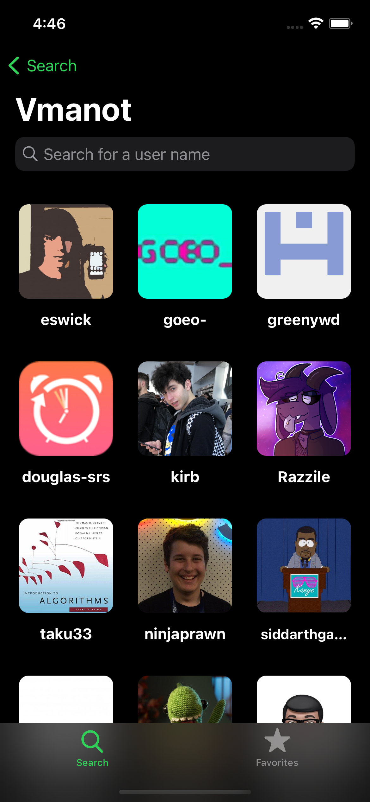
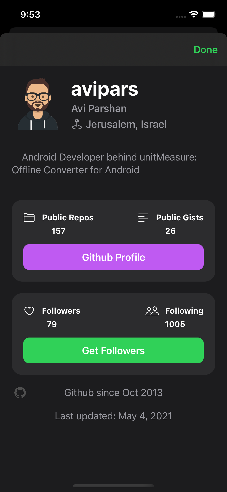
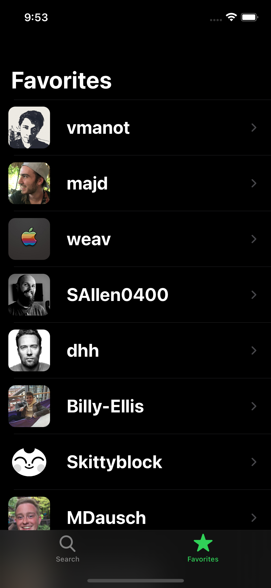
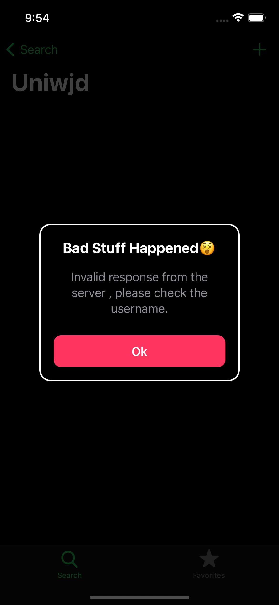
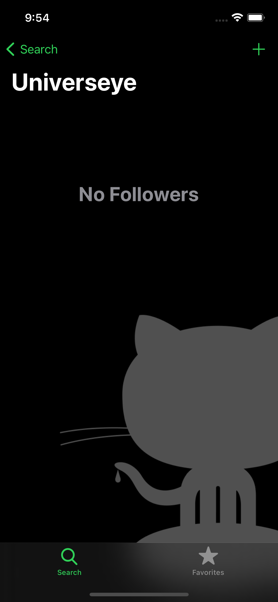

# Github Follower App

UIKit, This app shows the followers of github account by searching the username, follow the courses by [Sean Allen](https://seanallen.teachable.com/).

# Menu
* [Screenshots](#screenshots)
* [Features](#features)
* [To-Do](#to-do)
* [Source](#source)
* [Contributions](#contributions)
* [Contact](#contact)

# Screenshots

   

   

**Error Screen**

**Empty Followers/Favorites Screen**

# Features

* Fully programmatically UI
* User default for favorite users
* Customized alert screen
* Diffable data sources
* List pagination

### To-Do
* Allow showing user's info directly from favorites screen

### Bugs
* There's a bug when you scroll to the bottom of the followers list when you are searching, the outcome will not match.

# Source
The courses: [Sean Allen](https://seanallen.teachable.com/), fully developed with Swift.

### API

[Github](https://docs.github.com/en/rest)

# Contributions

* All kinds of contributions (enhancements, new features, documentation & code improvements, issues & bugs reporting & todo task) are welcome. Let's make it better.

# Contact
Created by [Terry Kuo](https://twitter.com/ArgonYoYo) - feel free to contact me!
